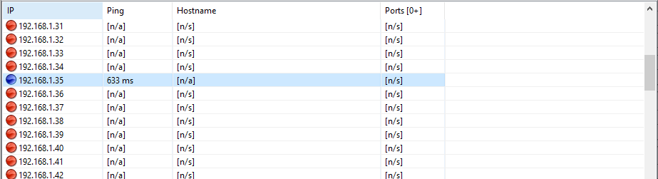
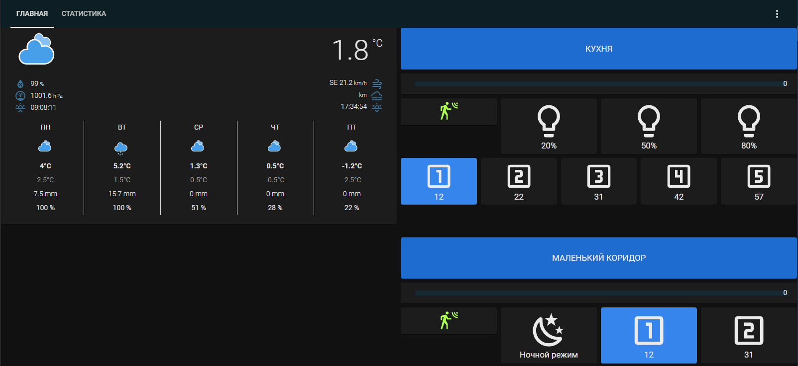

# esp8266_ws2812
WS2812 LED strip controller

Easy to repeat project (hardware + arduino project + HomeAssistant configuration examples) to control WS2812 LED strip via WIFI, MQTT protocol. NodeMCU (ESP8266) was used as a control module.

## Steps to reproduce a project
1. What you need to have: ESP8266 module, WS2812 LED strip, HC-SR501 PIR motion sensor (you can have another one with similar functionality, you can do it without a sensor at all), a power supply for all electronics (5V, the current depends on the length of the strip), MQTT broker (it can be a Raspberry Pi with Mosquitto or something else).
2. Download the repository.
3. Open the file "esp8266_ws2812.ino" in the Arduino IDE. Find the following lines and replace with the parameters of your WIFI network.
```c
	const char * _wifi_ssid = "XXXXXX";
	const char * _wifi_pwd = "XXXXXX";
	IPAddress _wifi_gateway (192, 168, 1, 1);
	IPAddress _wifi_subnet (255, 255, 255, 0);
```

4. Connect the NodeMCU module and flash it. Disconnect the NodeMCU.
5. Assemble the electrical circuit as shown in the figure:

6. Power up the circuit. Wait a few minutes before proceeding to step 7.
7. Now you need to find out the IP address of the controller (of course, if you correctly specified the parameters of your WIFI network). This can be done by using a program to ping devices on the network (for example, "Angry IP Scanner"):

8. Now we can connect to the controller from any browser and configure its parameters:

9. After setting the necessary parameters, save them and restart the controller.

## Basic parameters
Network parameters:
* "**Static IP**" - if necessary, a static IP address can be assigned to the controller. If the parameter is set to "0.0.0.0", then the IP address will be assigned by the router. For the MQTT protocol, it doesn't really matter how the IP address is assigned.
* "**Alias**" - a text field with a maximum length of 32 characters. Used for quick identification of controllers and in the names of topics.

LED strip parameters:
* "**Number of LEDs**" - the number of LEDs in the strip.
* "**Effects speed**" - effects execution speed. This parameter is passed to the "NeoPixelBus" library (thanks to its developers !!!) to control the speed of the effects.
* "**Pin index**" - the index of the pin to which the input of the LED strip is connected. If the circuit is assembled as in the image above, then you do not need to change.

PIR sensor parameters:
* "**Pin index**" - the index of the pin to which the output of the PIR sensor is connected. If the circuit is assembled as in the image above, then you do not need to change.

MQTT parameters (most interesting):
* "**Server IP**" - the IP address where the MQTT broker is deployed. In my case it is 192.168.1.10, used Raspberry Pi3+ and Mosquitto.
* "**Server port**" - the port on which the MQTT broker is listening.
* "**Username**" - username to connect to the MQTT broker.
* "**Password**" - password to connect to the MQTT broker.

## MQTT topics, provided by the controller
If everything is configured correctly and the controller has connected to the WIFI network and was able to connect to the MQTT broker, it will create the following topics (since the alias of my controller is "Kitchen", so all topics start with this word):
|	Topic		|	Description																|
|	:------		|	:---------																|
|	"Kitchen/ctrl/brightness"		|	this topic controls the brightness of the ribbon. Allowed values are from 0 to 255	|
|	"Kitchen/ctrl/effect"			|	this topic sets the current effect that the strip displays. In fact, this is the effect number for the "NeoPixelBus" library.	|
|	"Kitchen/state/brightness"		|	shows the current brightness of the strip. Values from 0 to 255.	|
|	"Kitchen/state/effect"			|	shows the current effect of the strip.	|
|	"Kitchen/state/pir"				|	shows the state of the PIR motion sensor. Values: 0 - no motion detected, 1 - motion present.	|
|	"Kitchen/state/rssi"			|	the current WIFI signal power value.	|

## Usage in Home Assistant
As part of the project files, there are examples of configuring the "Home Assistant" to get this result:

